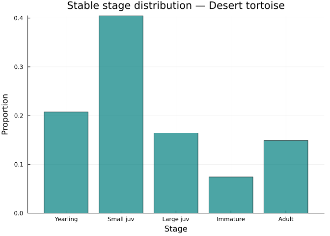
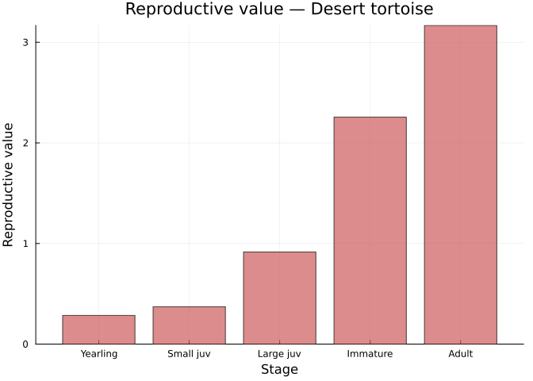
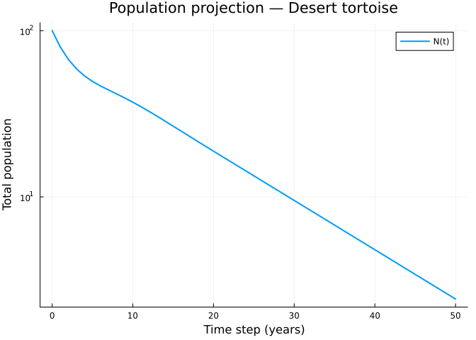
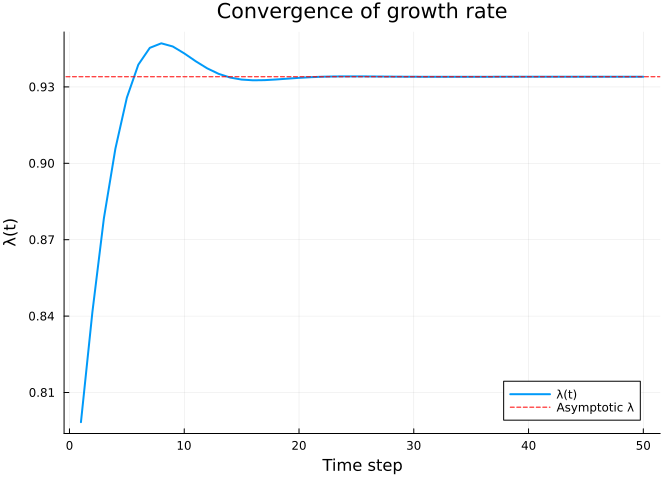
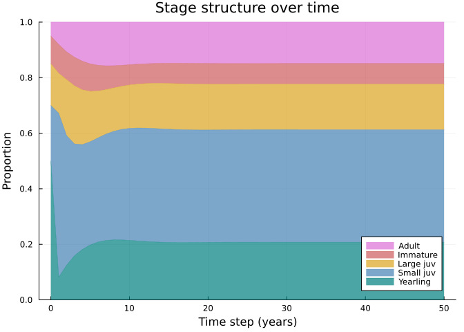
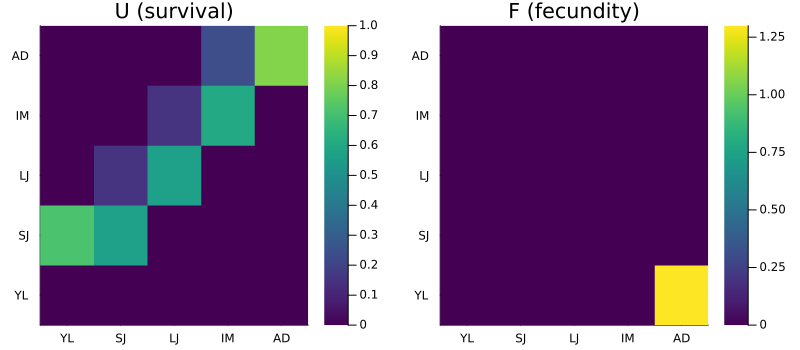

# Introduction to Matrix Projection Models
Simon Frost

## Overview

This vignette introduces **matrix projection models (MPMs)** — the
fundamental framework for analyzing structured population dynamics. We
construct an MPM for the desert tortoise (*Gopherus agassizii*), compute
the asymptotic growth rate $\lambda$, and examine the stable stage
distribution and reproductive value.

An MPM projects a population vector $\mathbf{n}(t)$ forward in time:

$$\mathbf{n}(t+1) = \mathbf{A} \cdot \mathbf{n}(t)$$

where $\mathbf{A}$ is the projection matrix and $\mathbf{n}(t)$ is a
vector of stage-specific abundances.

## Setup

``` julia
using MatrixProjectionModels
using LinearAlgebra
using Plots
```

## The Desert Tortoise

The desert tortoise (*Gopherus agassizii*) is a long-lived reptile
native to the Mojave and Sonoran deserts. This 5-stage model is based on
Doak, Kareiva & Klepetka (1994), one of the most influential
conservation applications of MPMs. The species was listed as threatened
under the U.S. Endangered Species Act in 1990.

### Stages

1.  **Yearling** — first-year juveniles (carapace length \< 60 mm)
2.  **Small juvenile** — 60–100 mm
3.  **Large juvenile** — 100–140 mm
4.  **Immature** — 140–175 mm
5.  **Adult** — \> 175 mm (reproductive)

### Matrix Construction

The projection matrix $\mathbf{A} = \mathbf{U} + \mathbf{F}$ decomposes
into a survival-transition matrix $\mathbf{U}$ and a fecundity matrix
$\mathbf{F}$.

``` julia
# Survival/transition matrix (Doak et al. 1994, based on BLM long-term data)
U = [0.0    0.0    0.0    0.0    0.0
     0.716  0.567  0.0    0.0    0.0
     0.0    0.149  0.567  0.0    0.0
     0.0    0.0    0.149  0.604  0.0
     0.0    0.0    0.0    0.235  0.817]

# Fecundity matrix (only adults reproduce)
F = [0.0  0.0  0.0  0.0  1.3
     0.0  0.0  0.0  0.0  0.0
     0.0  0.0  0.0  0.0  0.0
     0.0  0.0  0.0  0.0  0.0
     0.0  0.0  0.0  0.0  0.0]
```

    5×5 Matrix{Float64}:
     0.0  0.0  0.0  0.0  1.3
     0.0  0.0  0.0  0.0  0.0
     0.0  0.0  0.0  0.0  0.0
     0.0  0.0  0.0  0.0  0.0
     0.0  0.0  0.0  0.0  0.0

``` julia
mpm = MatrixProjectionModel(U, F;
    stage_names = [:yearling, :small_juv, :large_juv, :immature, :adult])
```

    MatrixProjectionModel{Float64} with 5 stages:
      Stage names: [:yearling, :small_juv, :large_juv, :immature, :adult]
      A (projection matrix):
    5×5 Matrix{Float64}:
     0.0    0.0    0.0    0.0    1.3
     0.716  0.567  0.0    0.0    0.0
     0.0    0.149  0.567  0.0    0.0
     0.0    0.0    0.149  0.604  0.0
     0.0    0.0    0.0    0.235  0.817

### Inspecting the Matrix

The full projection matrix $\mathbf{A} = \mathbf{U} + \mathbf{F}$:

``` julia
A = Matrix(mpm)
```

    5×5 Matrix{Float64}:
     0.0    0.0    0.0    0.0    1.3
     0.716  0.567  0.0    0.0    0.0
     0.0    0.149  0.567  0.0    0.0
     0.0    0.0    0.149  0.604  0.0
     0.0    0.0    0.0    0.235  0.817

## Eigenanalysis

The asymptotic growth rate $\lambda$ is the dominant eigenvalue of
$\mathbf{A}$. The population grows if $\lambda > 1$, declines if
$\lambda < 1$, and is stationary if $\lambda = 1$.

``` julia
lam = lambda(mpm)
println("Asymptotic growth rate (λ): ", round(lam, digits=4))
println("Population is ", lam > 1 ? "growing" : "declining")
```

    Asymptotic growth rate (λ): 0.934
    Population is declining

### Stable Stage Distribution

The stable stage distribution $\mathbf{w}$ is the right eigenvector of
$\mathbf{A}$, normalized to sum to 1. It gives the proportional
distribution across stages at equilibrium.

``` julia
w = stable_distribution(mpm)

bar(["Yearling", "Small juv", "Large juv", "Immature", "Adult"],
    w,
    xlabel="Stage", ylabel="Proportion",
    title="Stable stage distribution — Desert tortoise",
    legend=false, color=:teal, alpha=0.7)
```



### Reproductive Value

The reproductive value $\mathbf{v}$ is the left eigenvector. It measures
each stage’s expected contribution to future population growth, relative
to the first stage.

``` julia
v = reproductive_value(mpm)

bar(["Yearling", "Small juv", "Large juv", "Immature", "Adult"],
    v,
    xlabel="Stage", ylabel="Reproductive value",
    title="Reproductive value — Desert tortoise",
    legend=false, color=:indianred, alpha=0.7)
```



Adults have the highest reproductive value because they are closest to
(or already at) the reproductive stage and have high survival.

### Damping Ratio

The damping ratio $\rho = |\lambda_1| / |\lambda_2|$ measures how
quickly the population converges to the stable stage distribution.
Higher values indicate faster convergence.

``` julia
rho = damping_ratio(mpm)
println("Damping ratio (ρ): ", round(rho, digits=4))
```

    Damping ratio (ρ): 1.3068

## Population Projection

We can project the population forward in time using direct iteration.
Starting from an initial population vector, we apply
$\mathbf{n}(t+1) = \mathbf{A} \cdot \mathbf{n}(t)$ repeatedly.

``` julia
# Start with 100 individuals distributed across stages
n0 = [50.0, 20.0, 15.0, 10.0, 5.0]

prob = MPMProblem(mpm, n0, (0, 50))
sol = solve(prob, DirectIteration())
```

    MPMSolution(51 timesteps, retcode=Success)

``` julia
# Total population over time
total_pop = [sum(u) for u in sol.u]

plot(0:50, total_pop,
    xlabel="Time step (years)",
    ylabel="Total population",
    title="Population projection — Desert tortoise",
    label="N(t)", linewidth=2, yscale=:log10)
```



### Convergence to Stable Growth

``` julia
plot(sol.lambdas,
    xlabel="Time step",
    ylabel="λ(t)",
    title="Convergence of growth rate",
    label="λ(t)", linewidth=2)
hline!([lam], label="Asymptotic λ", linestyle=:dash, color=:red)
```



### Stage Structure Over Time

``` julia
# Extract proportions at each time step
props = hcat([u ./ sum(u) for u in sol.u]...)'
stage_labels = ["Yearling" "Small juv" "Large juv" "Immature" "Adult"]

cumprops = cumsum(props, dims=2)
colors = [:teal :steelblue :goldenrod :indianred :orchid]
p = plot(xlabel="Time step (years)", ylabel="Proportion",
    title="Stage structure over time", ylims=(0, 1))
for j in size(cumprops, 2):-1:1
    lower = j > 1 ? cumprops[:, j-1] : zeros(size(cumprops, 1))
    plot!(p, 0:50, cumprops[:, j], fillrange=lower,
        label=stage_labels[j], alpha=0.7, color=colors[j],
        linewidth=0.5)
end
p
```



## Matrix Properties

``` julia
println("Number of stages: ", n_stages(mpm))
println("Ergodic: ", is_ergodic(Matrix(mpm)))
println("Primitive: ", is_primitive(Matrix(mpm)))
println("Leslie structure: ", is_leslie(Matrix(mpm)))
```

    Number of stages: 5
    Ergodic: true
    Primitive: true
    Leslie structure: false

## Matrix Decomposition

The decomposition $\mathbf{A} = \mathbf{U} + \mathbf{F}$ (+ $\mathbf{C}$
for clonal reproduction) is fundamental to demographic analysis. The
survival matrix $\mathbf{U}$ describes transitions among existing
individuals, while $\mathbf{F}$ describes the production of new
individuals.

``` julia
p1 = heatmap(["YL","SJ","LJ","IM","AD"], ["YL","SJ","LJ","IM","AD"],
    mpm.U, title="U (survival)", color=:viridis, clims=(0, 1))
p2 = heatmap(["YL","SJ","LJ","IM","AD"], ["YL","SJ","LJ","IM","AD"],
    mpm.F, title="F (fecundity)", color=:viridis)
plot(p1, p2, layout=(1,2), size=(800, 350))
```



## Summary

In this vignette we:

1.  Constructed a 5-stage MPM for the desert tortoise from survival and
    fecundity matrices
2.  Computed the asymptotic growth rate $\lambda$ (the population is
    declining)
3.  Examined the stable stage distribution (dominated by yearlings and
    small juveniles)
4.  Computed reproductive values (adults have highest value)
5.  Projected population dynamics over 50 years
6.  Visualized convergence to stable growth and stage structure

The next vignette covers age-structured (Leslie) models with parametric
mortality and fecundity.
