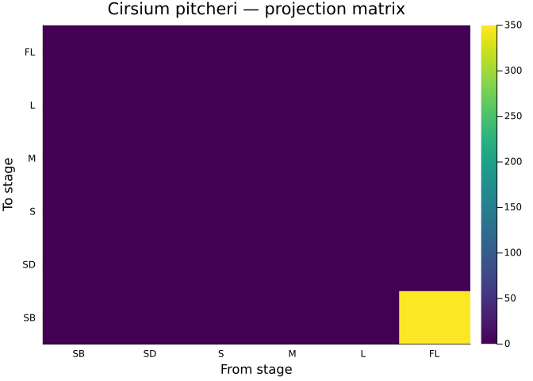
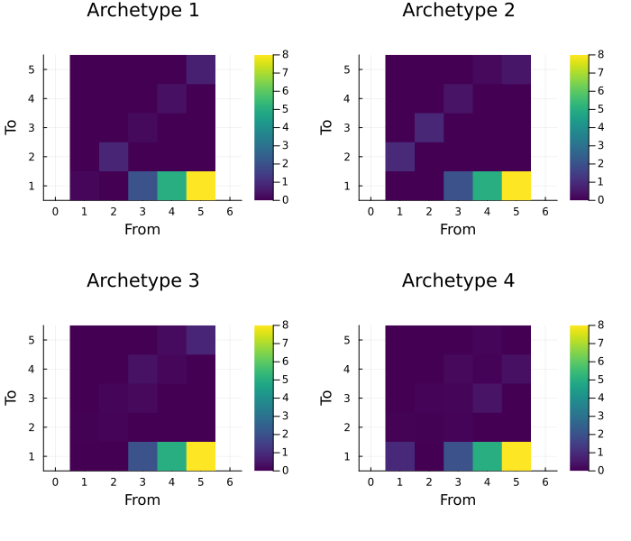
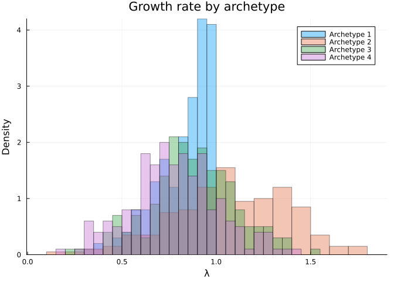
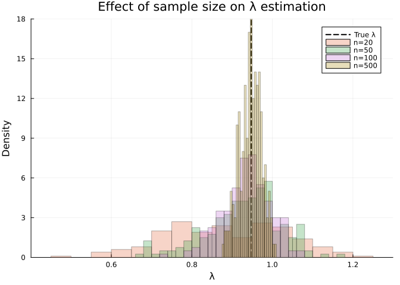

# Model Construction and Random Generation
Simon Frost

## Overview

This vignette covers construction of stage-structured (Lefkovitch)
matrix projection models, including random generation of biologically
plausible matrices using four life cycle archetypes from Takada et
al. (2018). It also demonstrates matrix decomposition, sampling error
simulation, and confidence interval estimation.

## Setup

``` julia
using MatrixProjectionModels
using Plots
using LinearAlgebra
using Statistics
```

## Stage-Structured (Lefkovitch) Matrices

Unlike Leslie (age-structured) matrices, Lefkovitch matrices classify
individuals by developmental stage rather than age. This allows
retrogression (moving backward to smaller stages), stasis (remaining in
the same stage), and variable stage durations — all common in plant and
invertebrate life histories.

### A COMPADRE Example: Pitcher’s Thistle

*Cirsium pitcheri* is a monocarpic perennial endemic to the Great Lakes
dunes, listed as threatened under the U.S. ESA. This 6-stage model is
based on Loveless (1984) and Hamzé & Jolls (2000), available in
COMPADRE.

``` julia
# Stages: seed bank, seedling, small rosette, medium rosette, large rosette, flowering
U_thistle = [0.00  0.00  0.00  0.00  0.00  0.00
             0.05  0.00  0.00  0.00  0.00  0.00
             0.00  0.30  0.45  0.08  0.00  0.00
             0.00  0.00  0.25  0.52  0.15  0.00
             0.00  0.00  0.00  0.20  0.55  0.00
             0.00  0.00  0.00  0.00  0.20  0.00]

F_thistle = [0.0  0.0  0.0  0.0  0.0  350.0
             0.0  0.0  0.0  0.0  0.0  0.0
             0.0  0.0  0.0  0.0  0.0  0.0
             0.0  0.0  0.0  0.0  0.0  0.0
             0.0  0.0  0.0  0.0  0.0  0.0
             0.0  0.0  0.0  0.0  0.0  0.0]

thistle = MatrixProjectionModel(U_thistle, F_thistle;
    stage_names=[:seed_bank, :seedling, :small, :medium, :large, :flowering])

println("Pitcher's thistle λ = ", round(lambda(thistle), digits=4))
```

    Pitcher's thistle λ = 0.9476

``` julia
heatmap(["SB","SD","S","M","L","FL"], ["SB","SD","S","M","L","FL"],
    Matrix(thistle),
    title="Cirsium pitcheri — projection matrix",
    color=:viridis, xlabel="From stage", ylabel="To stage")
```



### A COMADRE Example: Loggerhead Sea Turtle

This 5-stage model from Crouse, Crowder & Caswell (1987) became famous
for demonstrating that protecting large juveniles and subadults (via
turtle excluder devices, TEDs) is more effective for population recovery
than protecting eggs.

``` julia
U_turtle = [0.0     0.0     0.0     0.0     0.0
            0.6747  0.7370  0.0     0.0     0.0
            0.0     0.0486  0.6610  0.0     0.0
            0.0     0.0     0.0147  0.6907  0.0
            0.0     0.0     0.0     0.0518  0.8091]

F_turtle = [0.0  0.0  0.0  0.0  127.0
            0.0  0.0  0.0  0.0  0.0
            0.0  0.0  0.0  0.0  0.0
            0.0  0.0  0.0  0.0  0.0
            0.0  0.0  0.0  0.0  0.0]

turtle = MatrixProjectionModel(U_turtle, F_turtle;
    stage_names=[:egg_hatch, :sm_juv, :lg_juv, :subadult, :adult])

println("Loggerhead sea turtle λ = ", round(lambda(turtle), digits=4))
```

    Loggerhead sea turtle λ = 0.9706

## Random Lefkovitch Models

For simulation studies, theory testing, or power analysis, we can
generate random biologically plausible MPMs using `rand_lefko_mpm`. Four
life cycle archetypes control the pattern of transitions.

### The Four Archetypes

Following Takada et al. (2018):

- **Archetype 1**: All transitions possible (stasis, progression,
  retrogression)
- **Archetype 2**: Like 1, but survival increases monotonically with
  stage
- **Archetype 3**: Only stasis and forward progression (no
  retrogression) — typical of trees and long-lived plants
- **Archetype 4**: Like 3, but survival increases with stage

``` julia
fec = [0.0, 0.0, 2.0, 5.0, 8.0]  # increasing with stage

p_all = []
for arch in 1:4
    mpm = rand_lefko_mpm(5, fec; archetype=arch)
    p = heatmap(Matrix(mpm), title="Archetype $arch",
        color=:viridis, clims=(0, maximum(Matrix(mpm))),
        xlabel="From", ylabel="To", aspect_ratio=:equal)
    push!(p_all, p)
end
plot(p_all..., layout=(2,2), size=(700, 600))
```



### Generating and Comparing Sets

``` julia
# Generate 200 random MPMs per archetype and compare λ distributions
lambdas_by_arch = Dict{Int, Vector{Float64}}()

for arch in 1:4
    mpms = rand_lefko_set(200; n_stages=5, fecundity=fec, archetype=arch)
    lambdas_by_arch[arch] = [lambda(m) for m in mpms]
end

p = plot(xlabel="λ", ylabel="Density", title="Growth rate by archetype")
for arch in 1:4
    histogram!(p, lambdas_by_arch[arch], alpha=0.4, normalize=:pdf,
        label="Archetype $arch", bins=30)
end
p
```



### Constrained Generation

We can filter generated matrices to satisfy ecological constraints
(e.g., near-stationary populations):

``` julia
# Generate matrices with λ between 0.9 and 1.1
constrained_set = rand_lefko_set(50;
    n_stages=4,
    fecundity=[0.0, 1.0, 3.0, 5.0],
    archetype=3,
    constraint=m -> 0.9 < lambda(m) < 1.1)

lambdas_c = [lambda(m) for m in constrained_set]
println("Constrained λ range: [", round(minimum(lambdas_c), digits=3),
    ", ", round(maximum(lambdas_c), digits=3), "]")
```

    Constrained λ range: [0.907, 1.097]

## Matrix Decomposition

Given a full matrix $\mathbf{A}$, we can decompose it into survival
($\mathbf{U}$) and fecundity ($\mathbf{F}$) components using
`mpm_split`. The heuristic assigns the first row to fecundity:

``` julia
# Start with just A (no U/F decomposition known)
A_only = Matrix(turtle)

mpm_decomposed = mpm_split(A_only)

println("U recovery error: ", maximum(abs.(mpm_decomposed.U .- U_turtle)))
println("F recovery error: ", maximum(abs.(mpm_decomposed.F .- F_turtle)))
```

    U recovery error: 0.0
    F recovery error: 0.0

## Sampling Error

In practice, MPM parameters are estimated from finite samples. We can
simulate the effect of sampling error on demographic estimates using
parametric bootstrapping.

### Adding Sampling Error

Survival transitions are resampled from Binomial distributions, and
fecundity from Poisson distributions:

``` julia
# The "true" desert tortoise model
true_mpm = MatrixProjectionModel(U_thistle, F_thistle)
true_lambda = lambda(true_mpm)

# Simulate MPMs with different sample sizes
sample_sizes = [20, 50, 100, 500]
n_boot = 200

p = plot(xlabel="λ", ylabel="Density",
    title="Effect of sample size on λ estimation")
vline!([true_lambda], label="True λ", linewidth=2, color=:black, linestyle=:dash)

for n in sample_sizes
    boot_lambdas = Float64[]
    for _ in 1:n_boot
        mpm_err = add_mpm_error(true_mpm, n)
        push!(boot_lambdas, lambda(mpm_err))
    end
    histogram!(p, boot_lambdas, alpha=0.3, normalize=:pdf,
        label="n=$n", bins=25)
end
p
```



### Confidence Intervals

`compute_ci` wraps the bootstrap procedure for any demographic
statistic:

``` julia
# 95% CI for λ with sample size 50
ci_lambda = compute_ci(true_mpm, lambda, 50; n_boot=1000)
println("λ = ", round(true_lambda, digits=4),
    " [", round(ci_lambda[1], digits=4), ", ", round(ci_lambda[2], digits=4), "]")
```

    λ = 0.9476 [0.9476, 0.7348]

``` julia
# 95% CI for generation time
ci_gen = compute_ci(true_mpm,
    m -> gen_time(m.U, m.F), 50; n_boot=1000)
true_gen = gen_time(U_thistle, F_thistle)
println("Generation time = ", round(true_gen, digits=2),
    " [", round(ci_gen[1], digits=2), ", ", round(ci_gen[2], digits=2), "]")
```

    Generation time = Inf [Inf, -194.55]

## Summary

In this vignette we:

1.  Built stage-structured MPMs from published COMPADRE/COMADRE data
    (pitcher’s thistle, sea turtle)
2.  Generated random Lefkovitch matrices using four life cycle
    archetypes
3.  Created constrained sets of matrices for simulation studies
4.  Demonstrated matrix decomposition (`mpm_split`)
5.  Simulated sampling error and computed bootstrap confidence intervals

The next vignette covers vital rate extraction and decomposition.
