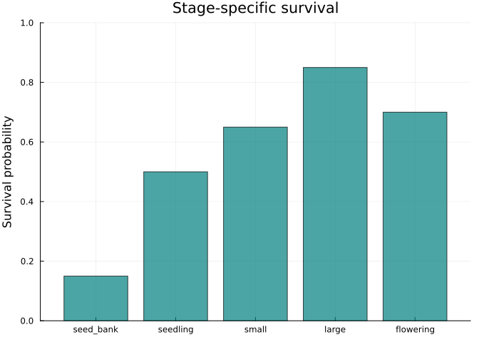
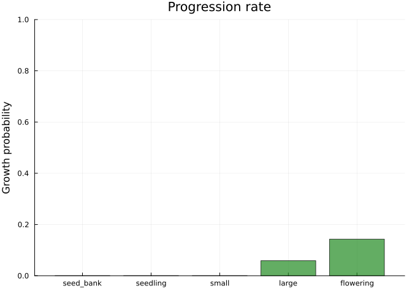
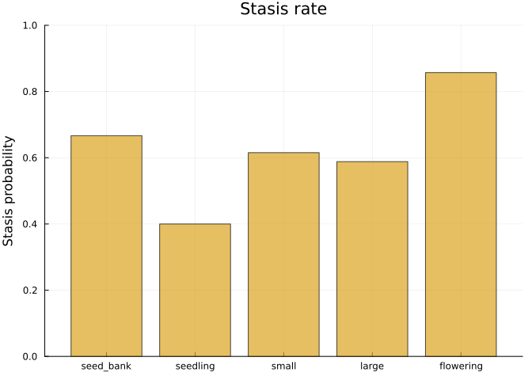
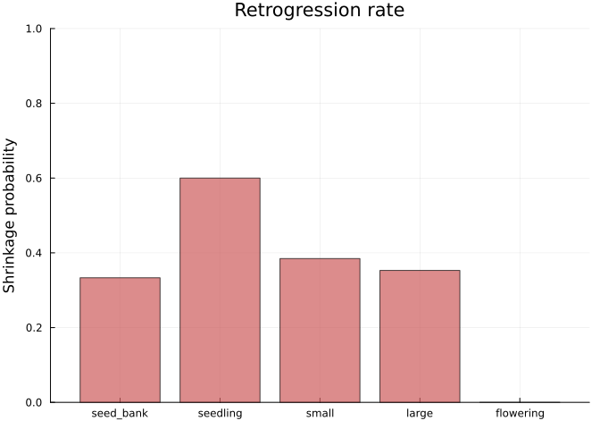
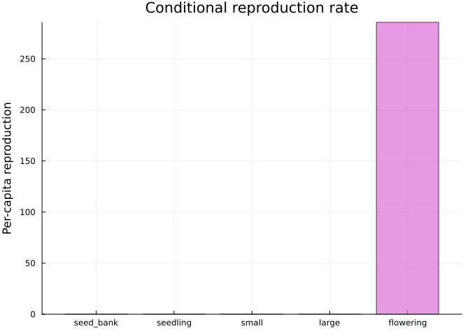
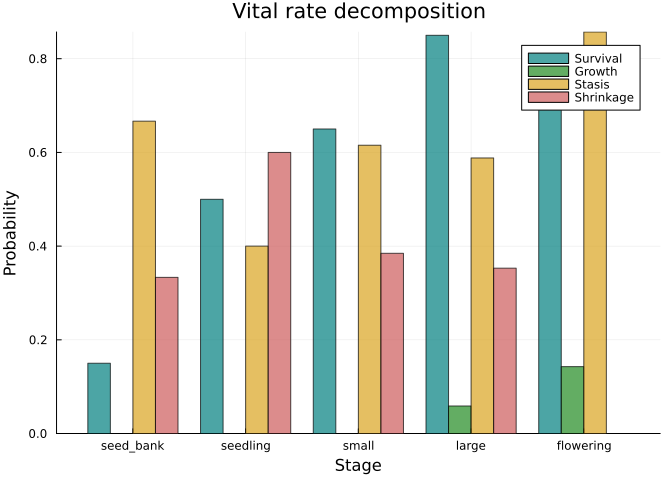
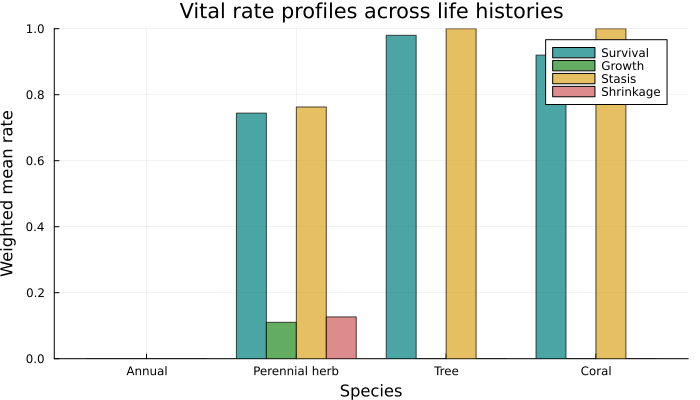

# Vital Rate Extraction and Decomposition
Simon Frost

## Overview

Matrix elements encode *multiple* demographic processes simultaneously —
a single transition $a_{ij}$ may reflect survival, growth, and stasis
combined. This vignette demonstrates how to decompose MPMs into
interpretable **vital rates**: survival, growth (progression), shrinkage
(retrogression), stasis, and reproduction. These decompositions follow
the framework of Rage (Jouganous et al. 2022) and are essential for
comparative demography.

## Setup

``` julia
using MatrixProjectionModels
using Plots
using LinearAlgebra
```

## Example Species

We use a 5-stage model for a hypothetical perennial herb (based on
typical COMPADRE plant matrices), with stages representing: seed bank,
seedling, small vegetative, large vegetative, and flowering.

``` julia
# Survival/transition matrix
U = [0.10  0.00  0.00  0.00  0.00
     0.05  0.20  0.00  0.00  0.00
     0.00  0.30  0.40  0.05  0.00
     0.00  0.00  0.25  0.50  0.10
     0.00  0.00  0.00  0.30  0.60]

# Fecundity matrix (only flowering plants produce seeds)
F = [0.0  0.0  0.0  0.0  200.0
     0.0  0.0  0.0  0.0  0.0
     0.0  0.0  0.0  0.0  0.0
     0.0  0.0  0.0  0.0  0.0
     0.0  0.0  0.0  0.0  0.0]

stage_names = [:seed_bank, :seedling, :small, :large, :flowering]
mpm = MatrixProjectionModel(U, F; stage_names=stage_names)
println("λ = ", round(lambda(mpm), digits=4))
```

    λ = 1.142

## Stage-Specific Vital Rates

### Survival

Total survival probability for each stage — the column sum of
$\mathbf{U}$:

``` julia
surv = vr_vec_survival(U)
bar(String.(stage_names), surv,
    ylabel="Survival probability", title="Stage-specific survival",
    legend=false, color=:teal, alpha=0.7, ylims=(0, 1))
```



### Growth (Progression)

The probability of moving to a *later* (larger/more advanced) stage,
conditional on survival:

``` julia
growth = vr_vec_growth(U)
bar(String.(stage_names), growth,
    ylabel="Growth probability", title="Progression rate",
    legend=false, color=:forestgreen, alpha=0.7, ylims=(0, 1))
```



### Stasis

The probability of remaining in the same stage:

``` julia
stasis = vr_vec_stasis(U)
bar(String.(stage_names), stasis,
    ylabel="Stasis probability", title="Stasis rate",
    legend=false, color=:goldenrod, alpha=0.7, ylims=(0, 1))
```



### Shrinkage (Retrogression)

The probability of moving to an *earlier* (smaller) stage:

``` julia
shrink = vr_vec_shrinkage(U)
bar(String.(stage_names), shrink,
    ylabel="Shrinkage probability", title="Retrogression rate",
    legend=false, color=:indianred, alpha=0.7, ylims=(0, 1))
```



### Reproduction

Stage-specific reproduction rate, conditional on survival. This uses
$\mathbf{F}$ and $\mathbf{U}$:

``` julia
repro = vr_vec_reproduction(U, F)
bar(String.(stage_names), repro,
    ylabel="Per-capita reproduction", title="Conditional reproduction rate",
    legend=false, color=:orchid, alpha=0.7)
```



### Combined Vital Rate Profile

``` julia
data = hcat(surv, growth, stasis, shrink)
vr_labels = ["Survival", "Growth", "Stasis", "Shrinkage"]
vr_colors = [:teal :forestgreen :goldenrod :indianred]
n_groups = length(stage_names)
n_cats = 4
width = 0.2
offsets = (-(n_cats-1)/2:(n_cats-1)/2) .* width
p = plot(xlabel="Stage", ylabel="Probability",
    title="Vital rate decomposition", legend=:topright)
for j in 1:n_cats
    bar!(p, (1:n_groups) .+ offsets[j], data[:, j],
        bar_width=width, label=vr_labels[j],
        color=vr_colors[j], alpha=0.7)
end
plot!(p, xticks=(1:n_groups, String.(stage_names)))
p
```



## Weighted Mean Vital Rates

For summary comparisons across species, we compute mean vital rates
weighted by the stable stage distribution:

``` julia
println("Mean survival:    ", round(vr_survival(U), digits=4))
println("Mean growth:      ", round(vr_growth(U), digits=4))
println("Mean shrinkage:   ", round(vr_shrinkage(U), digits=4))
println("Mean stasis:      ", round(vr_stasis(U), digits=4))
println("Mean fecundity:   ", round(vr_fecundity(U, F), digits=4))
```

    Mean survival:    0.7443
    Mean growth:      0.1104
    Mean shrinkage:   0.1268
    Mean stasis:      0.7629
    Mean fecundity:   184.2464

### Custom Weights

You can supply custom weights instead of the stable distribution:

``` julia
# Equal weighting across stages
equal_weights = fill(1.0 / 5, 5)
println("Equal-weighted mean survival: ",
    round(vr_survival(U; weights=equal_weights), digits=4))
```

    Equal-weighted mean survival: 0.57

## Dormancy Transitions

For species with dormant stages (e.g., seed banks), we can extract
dormancy entry and exit rates:

``` julia
# Stages 1 (seed bank) is dormant
dorm_enter = vr_vec_dorm_enter(U; dorm_stages=[1])
dorm_exit = vr_vec_dorm_exit(U; dorm_stages=[1])

println("Dormancy entry rates: ", round.(dorm_enter, digits=4))
println("Dormancy exit rates:  ", round.(dorm_exit, digits=4))
```

    Dormancy entry rates: [0.0, 0.0, 0.0, 0.0, 0.0]
    Dormancy exit rates:  [0.3333, 0.0, 0.0, 0.0, 0.0]

## Comparing Species from COMPADRE/COMADRE

Let us compare vital rate profiles across three contrasting life
histories.

``` julia
# Short-lived annual (like Arabidopsis)
U_annual = [0.0  0.0
            0.4  0.0]
F_annual = [0.0  8.0
            0.0  0.0]

# Long-lived tree (like Tsuga canadensis, Eastern hemlock, from COMPADRE)
U_tree = [0.00  0.00  0.00  0.00
          0.01  0.55  0.00  0.00
          0.00  0.10  0.85  0.00
          0.00  0.00  0.05  0.98]
F_tree = [0.0  0.0  5.0  50.0
          0.0  0.0  0.0  0.0
          0.0  0.0  0.0  0.0
          0.0  0.0  0.0  0.0]

# Coral (like Acropora, from COMADRE — high stasis, low growth)
U_coral = [0.60  0.00  0.00  0.00
           0.10  0.70  0.00  0.00
           0.00  0.08  0.85  0.00
           0.00  0.00  0.05  0.92]
F_coral = [0.0  0.5  2.0  10.0
           0.0  0.0  0.0  0.0
           0.0  0.0  0.0  0.0
           0.0  0.0  0.0  0.0]
```

    4×4 Matrix{Float64}:
     0.0  0.5  2.0  10.0
     0.0  0.0  0.0   0.0
     0.0  0.0  0.0   0.0
     0.0  0.0  0.0   0.0

``` julia
species = ["Annual", "Perennial herb", "Tree", "Coral"]
U_list = [U_annual, U, U_tree, U_coral]
data = zeros(4, 4)  # species × vital rates

for (i, Ui) in enumerate(U_list)
    data[i, 1] = vr_survival(Ui)
    data[i, 2] = vr_growth(Ui)
    data[i, 3] = vr_stasis(Ui)
    data[i, 4] = vr_shrinkage(Ui)
end

vr_labels2 = ["Survival", "Growth", "Stasis", "Shrinkage"]
vr_colors2 = [:teal :forestgreen :goldenrod :indianred]
n_sp = length(species)
n_vr = 4
w2 = 0.2
off2 = (-(n_vr-1)/2:(n_vr-1)/2) .* w2
p2 = plot(xlabel="Species", ylabel="Weighted mean rate",
    title="Vital rate profiles across life histories",
    legend=:topright, size=(700, 400))
for j in 1:n_vr
    bar!(p2, (1:n_sp) .+ off2[j], data[:, j],
        bar_width=w2, label=vr_labels2[j],
        color=vr_colors2[j], alpha=0.7)
end
plot!(p2, xticks=(1:n_sp, species))
p2
```



Trees and corals are characterized by high stasis and survival; annuals
have high growth but low survival. This pattern reflects the classic
fast-slow life history continuum.

## Summary

In this vignette we:

1.  Decomposed MPMs into six vital rate categories (survival, growth,
    shrinkage, stasis, reproduction, dormancy)
2.  Visualized stage-specific vital rate profiles
3.  Computed weighted mean vital rates for cross-species comparison
4.  Compared vital rate profiles across four contrasting life histories

The next vignette covers age-from-stage analysis and life table
construction.
