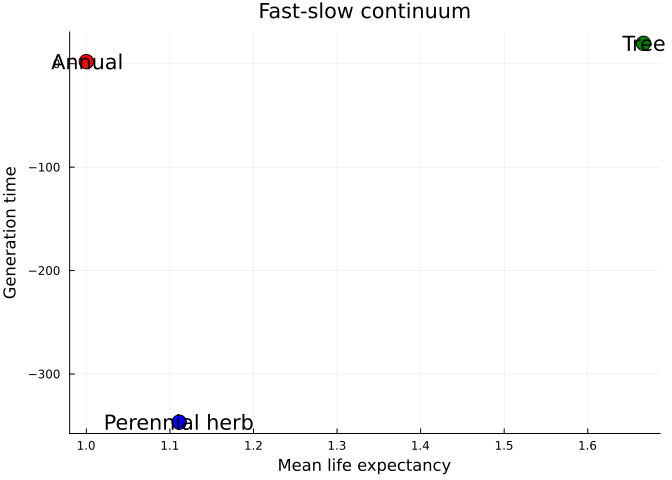

# Life History Traits
Simon Frost

## Overview

Matrix projection models encode a species’ entire demographic strategy.
From the survival matrix $\mathbf{U}$ and fecundity matrix $\mathbf{F}$,
we can derive a suite of **life history traits**: life expectancy,
generation time, net reproductive rate, age at maturity, longevity, and
senescence measures. This vignette demonstrates all trait calculations
available in MatrixProjectionModels.jl and compares traits across
species from COMPADRE and COMADRE.

## Setup

``` julia
using MatrixProjectionModels
using Plots
using LinearAlgebra
```

## Example Species

We define three contrasting species for comparison.

``` julia
# 1. Short-lived annual plant (like Arabidopsis from COMPADRE)
#    2 stages: vegetative, reproductive
U_annual = [0.00  0.00
            0.40  0.00]
F_annual = [0.0  8.0
            0.0  0.0]

# 2. Medium-lived perennial herb (like Calathea ovandensis from COMPADRE)
#    4 stages: seed, juvenile, vegetative adult, reproductive adult
U_herb = [0.10  0.00  0.00  0.00
          0.05  0.40  0.00  0.00
          0.00  0.20  0.60  0.05
          0.00  0.00  0.20  0.75]
F_herb = [0.0  0.0  0.0  25.0
          0.0  0.0  0.0  0.0
          0.0  0.0  0.0  0.0
          0.0  0.0  0.0  0.0]

# 3. Long-lived tree (like Tsuga from COMPADRE)
#    4 stages: seedling, sapling, small tree, large tree
U_tree = [0.40  0.00  0.00  0.00
          0.10  0.75  0.00  0.00
          0.00  0.05  0.92  0.00
          0.00  0.00  0.03  0.98]
F_tree = [0.0  0.0  2.0  40.0
          0.0  0.0  0.0  0.0
          0.0  0.0  0.0  0.0
          0.0  0.0  0.0  0.0]

species_names = ["Annual", "Perennial herb", "Tree"]
U_list = [U_annual, U_herb, U_tree]
F_list = [F_annual, F_herb, F_tree]
```

    3-element Vector{Matrix{Float64}}:
     [0.0 8.0; 0.0 0.0]
     [0.0 0.0 0.0 25.0; 0.0 0.0 0.0 0.0; 0.0 0.0 0.0 0.0; 0.0 0.0 0.0 0.0]
     [0.0 0.0 2.0 40.0; 0.0 0.0 0.0 0.0; 0.0 0.0 0.0 0.0; 0.0 0.0 0.0 0.0]

## Life Expectancy

Mean life expectancy from a given starting stage, derived from the
fundamental matrix $\mathbf{N} = (\mathbf{I} - \mathbf{U})^{-1}$:

$$E[T] = \mathbf{e}_{\text{start}}^\top \mathbf{N} \mathbf{1}$$

``` julia
for (name, U) in zip(species_names, U_list)
    le = life_expect_mean(U; start=1)
    println("$name — mean life expectancy: ", round(le, digits=2), " time steps")
end
```

    Annual — mean life expectancy: 1.0 time steps
    Perennial herb — mean life expectancy: 1.11 time steps
    Tree — mean life expectancy: 1.67 time steps

### Variance in Life Expectancy

``` julia
for (name, U) in zip(species_names, U_list)
    v = life_expect_var(U; start=1)
    println("$name — variance in life expectancy: ", round(v, digits=2))
end
```

    Annual — variance in life expectancy: 0.0
    Perennial herb — variance in life expectancy: 0.12
    Tree — variance in life expectancy: 1.11

## Longevity

The age at which survivorship drops below a threshold (default 1%):

``` julia
for (name, U) in zip(species_names, U_list)
    l = longevity(U; start=1, lx_crit=0.01)
    println("$name — longevity (l(x) < 0.01): age ", l)
end
```

    Annual — longevity (l(x) < 0.01): age 2
    Perennial herb — longevity (l(x) < 0.01): age 6
    Tree — longevity (l(x) < 0.01): age 38

## Net Reproductive Rate

The net reproductive rate $R_0$ is the expected number of offspring
produced by an individual over its lifetime. A population grows if
$R_0 > 1$:

$$R_0 = \sum_x l(x) \cdot m(x)$$

``` julia
for (name, U, F) in zip(species_names, U_list, F_list)
    R0 = net_repro_rate(U, F; start=1)
    println("$name — R₀ = ", round(R0, digits=4))
end
```

    Annual — R₀ = 3.2
    Perennial herb — R₀ = 0.3725
    Tree — R₀ = 9.2795

## Generation Time

The mean age of parents of offspring produced at the stable stage
distribution. Three methods are available:

1.  **`:R0`** — $T = \log(R_0) / \log(\lambda)$ (most common)
2.  **`:cohort`** — Mean age of reproduction in a cohort
3.  **`:age_diff`** — Mean age of parents minus mean age of offspring

``` julia
for (name, U, F) in zip(species_names, U_list, F_list)
    T_r0 = gen_time(U, F; start=1, method=:R0)
    T_coh = gen_time(U, F; start=1, method=:cohort)
    println("$name — generation time: R₀ method = ", round(T_r0, digits=2),
        ", cohort method = ", round(T_coh, digits=2))
end
```

    Annual — generation time: R₀ method = 2.0, cohort method = 1.0
    Perennial herb — generation time: R₀ method = -346.56, cohort method = 4.8
    Tree — generation time: R₀ method = 19.74, cohort method = 23.52

## Maturity

### Probability of Reaching Maturity

The probability that a newborn will survive to first reach a
reproductive stage:

``` julia
for (name, U, F) in zip(species_names, U_list, F_list)
    p = mature_prob(U, F; start=1)
    println("$name — P(maturity) = ", round(p, digits=4))
end
```

    Annual — P(maturity) = 0.4
    Perennial herb — P(maturity) = 0.0093
    Tree — P(maturity) = 0.0333

### Mean Age at First Reproduction

``` julia
for (name, U, F) in zip(species_names, U_list, F_list)
    a = mature_age(U, F; start=1)
    println("$name — mean age at maturity = ", round(a, digits=2))
end
```

    Annual — mean age at maturity = 1.0
    Perennial herb — mean age at maturity = 1.11
    Tree — mean age at maturity = 1.67

## Entropy and Senescence

### Keyfitz’s Entropy

Keyfitz’s entropy $H$ measures the shape of the survivorship curve.
$H < 1$ indicates Type I (convex) curves, $H = 1$ indicates Type II
(exponential), and $H > 1$ indicates Type III (concave) curves:

$$H = -\frac{\sum l(x) \log l(x)}{\sum l(x)}$$

``` julia
for (name, U) in zip(species_names, U_list)
    H = entropy_k_stage(U)
    curve_type = H < 1 ? "Type I (convex)" :
                 H ≈ 1 ? "Type II (exponential)" : "Type III (concave)"
    println("$name — Keyfitz H = ", round(H, digits=4), " → ", curve_type)
end
```

    Annual — Keyfitz H = 0.2618 → Type I (convex)
    Perennial herb — Keyfitz H = 0.5433 → Type I (convex)
    Tree — Keyfitz H = 1.4371 → Type III (concave)

### Demetrius’ Entropy

Demetrius’ entropy measures the diversity of the reproductive schedule:

``` julia
for (name, U, F) in zip(species_names, U_list, F_list)
    lx = mpm_to_lx(U; start=1)
    mx = mpm_to_mx(U, F; start=1)
    if length(mx) > 0 && any(mx .> 0)
        S = entropy_d(lx[1:length(mx)], mx)
        println("$name — Demetrius' entropy = ", round(S, digits=4))
    end
end
```

    Annual — Demetrius' entropy = 0.0
    Perennial herb — Demetrius' entropy = 1.3411
    Tree — Demetrius' entropy = 3.5103

## Shape of Survivorship and Reproduction

The `shape_surv` and `shape_rep` functions quantify the shape of
survivorship and reproductive curves on a standardized scale from -1/6
(strongly Type III / early reproduction) to +1/6 (strongly Type I / late
reproduction):

``` julia
for (name, U, F) in zip(species_names, U_list, F_list)
    lx = mpm_to_lx(U; start=1)
    s_surv = shape_surv(lx)
    s_rep = shape_rep(U, F; start=1)
    println("$name — shape(survival) = ", round(s_surv, digits=4),
        ", shape(reproduction) = ", round(s_rep, digits=4))
end
```

    Annual — shape(survival) = -0.05, shape(reproduction) = 0.25
    Perennial herb — shape(survival) = -0.3744, shape(reproduction) = -0.2643
    Tree — shape(survival) = -0.436, shape(reproduction) = -0.1977

## Comparative Life History Summary

``` julia
n = length(species_names)
traits = zeros(n, 6)

for i in 1:n
    traits[i, 1] = lambda(U_list[i] + F_list[i])
    traits[i, 2] = life_expect_mean(U_list[i]; start=1)
    traits[i, 3] = gen_time(U_list[i], F_list[i]; start=1, method=:R0)
    traits[i, 4] = net_repro_rate(U_list[i], F_list[i]; start=1)
    traits[i, 5] = mature_age(U_list[i], F_list[i]; start=1)
    traits[i, 6] = longevity(U_list[i]; start=1, lx_crit=0.01)
end

trait_names = ["λ", "Life expect.", "Gen. time", "R₀", "Age maturity", "Longevity"]

for j in 1:6
    println("\n$(trait_names[j]):")
    for i in 1:n
        println("  $(species_names[i]): ", round(traits[i, j], digits=3))
    end
end
```


    λ:
      Annual: 1.789
      Perennial herb: 1.003
      Tree: 1.119

    Life expect.:
      Annual: 1.0
      Perennial herb: 1.111
      Tree: 1.667

    Gen. time:
      Annual: 2.0
      Perennial herb: -346.564
      Tree: 19.741

    R₀:
      Annual: 3.2
      Perennial herb: 0.372
      Tree: 9.28

    Age maturity:
      Annual: 1.0
      Perennial herb: 1.111
      Tree: 1.667

    Longevity:
      Annual: 2.0
      Perennial herb: 6.0
      Tree: 38.0

### Fast-Slow Continuum

The classic fast-slow life history continuum: short-lived species with
high reproduction vs. long-lived species with delayed reproduction.

``` julia
scatter(traits[:, 2], traits[:, 3],
    xlabel="Mean life expectancy",
    ylabel="Generation time",
    title="Fast-slow continuum",
    series_annotations=species_names,
    markersize=8, legend=false,
    color=[:red, :blue, :green])
```



## Summary

In this vignette we:

1.  Computed life expectancy (mean and variance) from the fundamental
    matrix
2.  Estimated longevity, net reproductive rate $R_0$, and generation
    time
3.  Measured probability and age of maturity
4.  Quantified senescence with Keyfitz’s and Demetrius’ entropy
5.  Characterized survivorship and reproduction shape
6.  Compared life history traits across the fast-slow continuum

The next vignette covers perturbation analysis (sensitivity and
elasticity).
