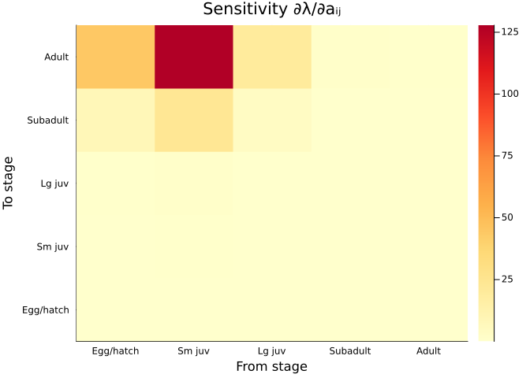
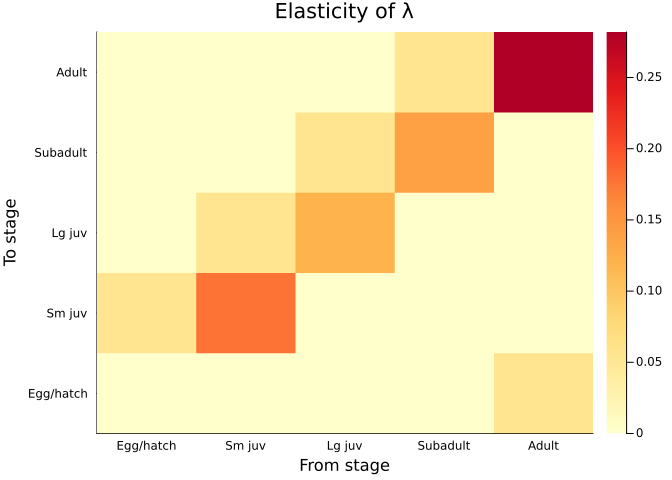
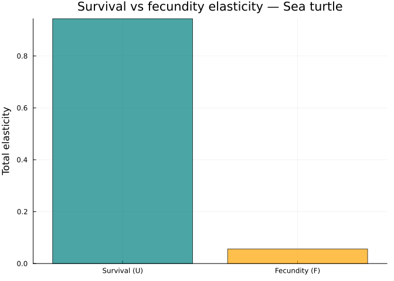
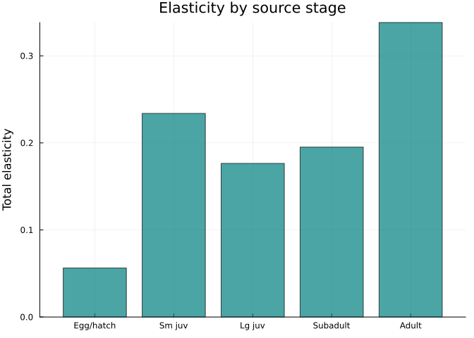
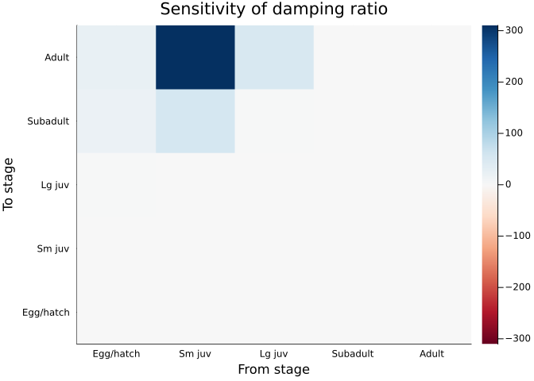
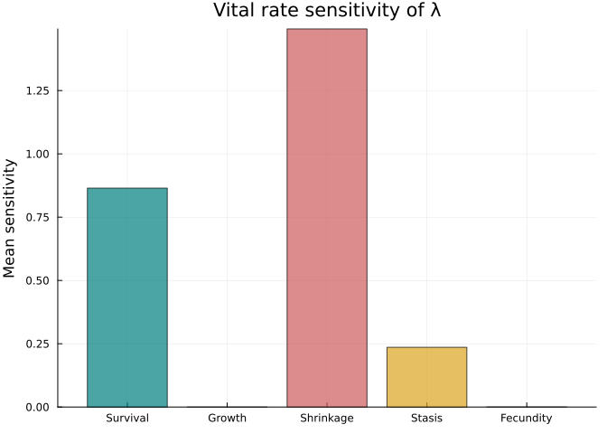
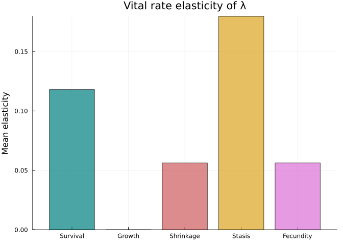
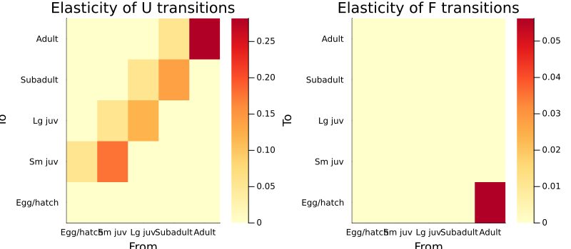
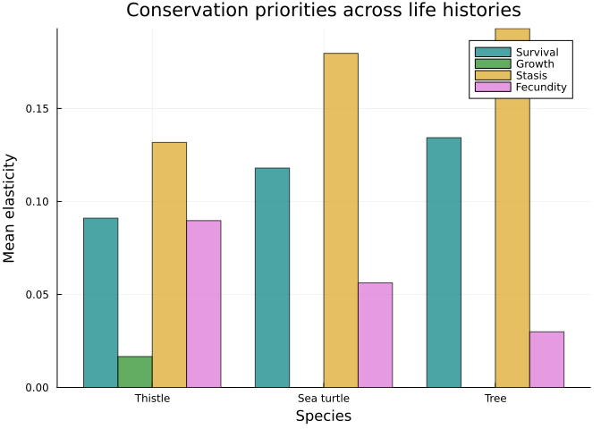

# Perturbation Analysis
Simon Frost

## Overview

**Perturbation analysis** asks: how much does $\lambda$ change when we
perturb a matrix element, a vital rate, or a transition? This is central
to conservation biology — it identifies which demographic processes most
influence population growth, guiding management interventions. This
vignette demonstrates four levels of perturbation analysis, using the
loggerhead sea turtle as a case study for the famous “TED” (turtle
excluder device) argument.

## Setup

``` julia
using MatrixProjectionModels
using Plots
using LinearAlgebra
```

## The Loggerhead Sea Turtle

The Crouse et al. (1987) sea turtle model became one of the most
impactful applications of perturbation analysis. It showed that
protecting large juveniles and subadults (via turtle excluder devices on
shrimp trawls) would do far more for population recovery than protecting
eggs — overturning decades of conservation strategy focused on egg
protection.

``` julia
U = [0.0     0.0     0.0     0.0     0.0
     0.6747  0.7370  0.0     0.0     0.0
     0.0     0.0486  0.6610  0.0     0.0
     0.0     0.0     0.0147  0.6907  0.0
     0.0     0.0     0.0     0.0518  0.8091]

F = [0.0  0.0  0.0  0.0  127.0
     0.0  0.0  0.0  0.0  0.0
     0.0  0.0  0.0  0.0  0.0
     0.0  0.0  0.0  0.0  0.0
     0.0  0.0  0.0  0.0  0.0]

A = U + F
stage_names = ["Egg/hatch", "Sm juv", "Lg juv", "Subadult", "Adult"]

mpm = MatrixProjectionModel(U, F;
    stage_names=Symbol.(stage_names))
println("λ = ", round(lambda(mpm), digits=4))
```

    λ = 0.9706

## Level 1: Analytical Sensitivity and Elasticity

### Sensitivity

Sensitivity $s_{ij} = \partial\lambda / \partial a_{ij}$ measures the
absolute change in $\lambda$ per unit change in matrix element $a_{ij}$:

``` julia
S = sensitivity(mpm)

heatmap(stage_names, stage_names, S,
    title="Sensitivity ∂λ/∂aᵢⱼ",
    xlabel="From stage", ylabel="To stage",
    color=:YlOrRd)
```



### Elasticity

Elasticity
$e_{ij} = (a_{ij}/\lambda) \cdot (\partial\lambda/\partial a_{ij})$
measures the *proportional* change in $\lambda$ per proportional change
in $a_{ij}$. Elasticities sum to 1.

``` julia
E = elasticity(mpm)

heatmap(stage_names, stage_names, E,
    title="Elasticity of λ",
    xlabel="From stage", ylabel="To stage",
    color=:YlOrRd)
```



``` julia
# Elasticities sum to 1
println("Sum of elasticities: ", round(sum(E), digits=6))
```

    Sum of elasticities: 1.0

### The TED Argument

The key insight: elasticity of adult survival far exceeds elasticity of
egg production.

``` julia
# Elasticity of fecundity (F) vs survival (U) components
E_survival = sum(E .* (U .> 0))
E_fecundity = sum(E .* (F .> 0))

bar(["Survival (U)", "Fecundity (F)"],
    [E_survival, E_fecundity],
    ylabel="Total elasticity",
    title="Survival vs fecundity elasticity — Sea turtle",
    legend=false, color=[:teal, :orange], alpha=0.7)
```



``` julia
# Stage-specific elasticity summed across transitions
E_by_stage = vec(sum(E, dims=1))

bar(stage_names, E_by_stage,
    ylabel="Total elasticity",
    title="Elasticity by source stage",
    legend=false, color=:teal, alpha=0.7)
```



Large juveniles and adults contribute the most to $\lambda$ — protecting
them (via TEDs) is the most effective conservation strategy.

## Level 2: Numerical Matrix Perturbation

For any demographic statistic (not just $\lambda$), `perturb_matrix`
computes numerical perturbation of each matrix element:

``` julia
S_num = perturb_matrix(A; type=:sensitivity)
E_num = perturb_matrix(A; type=:elasticity)

println("Analytical vs numerical sensitivity max error: ",
    round(maximum(abs.(S - S_num)), digits=8))
```

    Analytical vs numerical sensitivity max error: 0.00811483

### Perturbation of Other Statistics

We can compute sensitivities for any scalar function of the matrix, such
as the damping ratio $\rho$ (rate of convergence to stable stage
distribution):

``` julia
# Sensitivity of damping ratio to matrix elements
S_rho = perturb_matrix(A; type=:sensitivity,
    demog_stat=a -> damping_ratio(MatrixProjectionModel(a)))

heatmap(stage_names, stage_names, S_rho,
    title="Sensitivity of damping ratio",
    xlabel="From stage", ylabel="To stage",
    color=:RdBu, clims=(-maximum(abs.(S_rho)), maximum(abs.(S_rho))))
```



## Level 3: Vital Rate Perturbation

Rather than perturbing individual matrix elements, `perturb_vr` perturbs
vital rate *components*: survival, growth (progression), shrinkage
(retrogression), stasis, and fecundity.

``` julia
vr_sens = perturb_vr(U, F; type=:sensitivity)

categories = ["Survival", "Growth", "Shrinkage", "Stasis", "Fecundity"]
values = [vr_sens.survival, vr_sens.growth, vr_sens.shrinkage,
          vr_sens.stasis, vr_sens.fecundity]

bar(categories, values,
    ylabel="Mean sensitivity",
    title="Vital rate sensitivity of λ",
    legend=false, color=[:teal, :forestgreen, :indianred, :goldenrod, :orchid],
    alpha=0.7)
```



``` julia
vr_elas = perturb_vr(U, F; type=:elasticity)

values_e = [vr_elas.survival, vr_elas.growth, vr_elas.shrinkage,
            vr_elas.stasis, vr_elas.fecundity]

bar(categories, values_e,
    ylabel="Mean elasticity",
    title="Vital rate elasticity of λ",
    legend=false, color=[:teal, :forestgreen, :indianred, :goldenrod, :orchid],
    alpha=0.7)
```



Stasis (remaining in the same stage) dominates — consistent with a
long-lived species where individuals spend many years in each stage.

## Level 4: Transition-Level Perturbation

`perturb_trans` returns sensitivity and elasticity matrices separately
for the $\mathbf{U}$ and $\mathbf{F}$ components:

``` julia
trans = perturb_trans(U, F; type=:elasticity)

p1 = heatmap(stage_names, stage_names, trans.U,
    title="Elasticity of U transitions",
    xlabel="From", ylabel="To", color=:YlOrRd)
p2 = heatmap(stage_names, stage_names, trans.F,
    title="Elasticity of F transitions",
    xlabel="From", ylabel="To", color=:YlOrRd)
plot(p1, p2, layout=(1,2), size=(800, 350))
```



## Comparative: Conservation Priorities

Let us compare perturbation results across species to demonstrate how
life history strategy determines which demographic processes matter
most.

``` julia
# Short-lived: Pitcher's thistle (monocarpic perennial)
U_thistle = [0.00  0.00  0.00  0.00  0.00  0.00
             0.05  0.00  0.00  0.00  0.00  0.00
             0.00  0.30  0.45  0.08  0.00  0.00
             0.00  0.00  0.25  0.52  0.15  0.00
             0.00  0.00  0.00  0.20  0.55  0.00
             0.00  0.00  0.00  0.00  0.20  0.00]
F_thistle = [0.0  0.0  0.0  0.0  0.0  350.0
             0.0  0.0  0.0  0.0  0.0  0.0
             0.0  0.0  0.0  0.0  0.0  0.0
             0.0  0.0  0.0  0.0  0.0  0.0
             0.0  0.0  0.0  0.0  0.0  0.0
             0.0  0.0  0.0  0.0  0.0  0.0]

# Long-lived: Tree (like Tsuga)
U_tree = [0.40  0.00  0.00  0.00
          0.10  0.75  0.00  0.00
          0.00  0.05  0.92  0.00
          0.00  0.00  0.03  0.98]
F_tree = [0.0  0.0  2.0  40.0
          0.0  0.0  0.0  0.0
          0.0  0.0  0.0  0.0
          0.0  0.0  0.0  0.0]
```

    4×4 Matrix{Float64}:
     0.0  0.0  2.0  40.0
     0.0  0.0  0.0   0.0
     0.0  0.0  0.0   0.0
     0.0  0.0  0.0   0.0

``` julia
results = Dict{String, NamedTuple}()
for (name, Ui, Fi) in [("Sea turtle", U, F),
                        ("Thistle", U_thistle, F_thistle),
                        ("Tree", U_tree, F_tree)]
    vr = perturb_vr(Ui, Fi; type=:elasticity)
    results[name] = vr
end

species_order = ["Thistle", "Sea turtle", "Tree"]
survival_e = [results[s].survival for s in species_order]
growth_e = [results[s].growth for s in species_order]
stasis_e = [results[s].stasis for s in species_order]
fecundity_e = [results[s].fecundity for s in species_order]

data = hcat(survival_e, growth_e, stasis_e, fecundity_e)
cat_labels = ["Survival", "Growth", "Stasis", "Fecundity"]
cat_colors = [:teal :forestgreen :goldenrod :orchid]
n_sp = length(species_order)
n_cat = 4
bw = 0.2
boff = (-(n_cat-1)/2:(n_cat-1)/2) .* bw
p_comp = plot(xlabel="Species", ylabel="Mean elasticity",
    title="Conservation priorities across life histories",
    legend=:topright)
for j in 1:n_cat
    bar!(p_comp, (1:n_sp) .+ boff[j], data[:, j],
        bar_width=bw, label=cat_labels[j],
        color=cat_colors[j], alpha=0.7)
end
plot!(p_comp, xticks=(1:n_sp, species_order))
p_comp
```



Short-lived species like the monocarpic thistle are more sensitive to
fecundity changes, while long-lived species (turtle, tree) are most
sensitive to survival changes — a fundamental pattern in life history
theory.

## Summary

In this vignette we:

1.  Computed analytical sensitivity and elasticity matrices
2.  Demonstrated the sea turtle TED argument — protecting juveniles is
    more effective than protecting eggs
3.  Used numerical perturbation for non-standard demographic statistics
4.  Decomposed perturbation by vital rate category (survival, growth,
    stasis, fecundity)
5.  Analyzed perturbation at the transition level ($\mathbf{U}$ vs
    $\mathbf{F}$)
6.  Compared conservation priorities across contrasting life histories

The next vignette covers stochastic MPMs and environmental variation.
