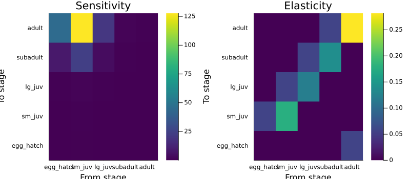
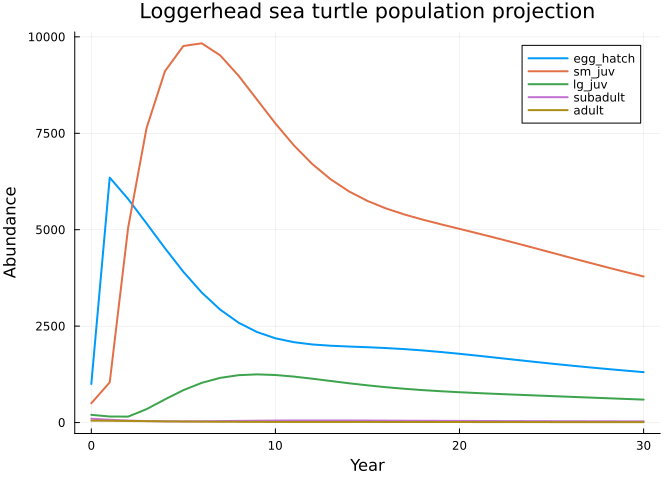

# Sparse Transition Constructors
Simon Frost

## Overview

Most real-world projection matrices are **sparse** — a 6-stage plant
model may have only 10 of 36 possible transitions. Writing out full
matrices by hand is tedious and error-prone, especially for large
models. This vignette introduces a sparse transition DSL that lets you
specify MPMs using `(from => to) => value` pairs, matching the way
ecologists think about life cycle graphs.

## Setup

``` julia
using MatrixProjectionModels
using LinearAlgebra
using Plots
```

## The Problem with Full Matrices

Consider the Pitcher’s thistle (*Cirsium pitcheri*), a 6-stage
monocarpic perennial from the COMPADRE database (Loveless 1984; Hamze &
Jolls 2000). The traditional way to specify the model requires writing
out two $6 \times 6$ matrices:

``` julia
U_thistle = [0.00  0.00  0.00  0.00  0.00  0.00
             0.05  0.00  0.00  0.00  0.00  0.00
             0.00  0.30  0.45  0.08  0.00  0.00
             0.00  0.00  0.25  0.52  0.15  0.00
             0.00  0.00  0.00  0.20  0.55  0.00
             0.00  0.00  0.00  0.00  0.20  0.00]

F_thistle = [0.0  0.0  0.0  0.0  0.0  350.0
             0.0  0.0  0.0  0.0  0.0  0.0
             0.0  0.0  0.0  0.0  0.0  0.0
             0.0  0.0  0.0  0.0  0.0  0.0
             0.0  0.0  0.0  0.0  0.0  0.0
             0.0  0.0  0.0  0.0  0.0  0.0]

thistle_manual = MatrixProjectionModel(U_thistle, F_thistle;
    stage_names=[:seed_bank, :seedling, :small, :medium, :large, :flowering])
```

    MatrixProjectionModel{Float64} with 6 stages:
      Stage names: [:seed_bank, :seedling, :small, :medium, :large, :flowering]
      A (projection matrix):
    6×6 Matrix{Float64}:
     0.0   0.0  0.0   0.0   0.0   350.0
     0.05  0.0  0.0   0.0   0.0     0.0
     0.0   0.3  0.45  0.08  0.0     0.0
     0.0   0.0  0.25  0.52  0.15    0.0
     0.0   0.0  0.0   0.2   0.55    0.0
     0.0   0.0  0.0   0.0   0.2     0.0

That is 72 numbers to type, of which 61 are zeros. The sparse transition
syntax makes the nonzero entries explicit.

## Sparse Transition Syntax

### Convention

Each transition is specified as `(from => to) => value`, where `from`
and `to` are stage names (symbols). This mirrors the arcs in a life
cycle graph: an arrow from stage `from` to stage `to` with rate or
probability `value`.

Internally, `(from => to) => value` sets `A[to_idx, from_idx] = value` —
the standard column-to-row convention for projection matrices.

### A-Only Construction

When the $\mathbf{U}$/$\mathbf{F}$/$\mathbf{C}$ decomposition is not
needed, pass all transitions as positional arguments:

``` julia
thistle_sparse = MatrixProjectionModel(
    [:seed_bank, :seedling, :small, :medium, :large, :flowering],
    # Survival/growth transitions
    (:seed_bank => :seedling)  => 0.05,
    (:seedling  => :small)     => 0.30,
    (:small     => :small)     => 0.45,
    (:small     => :medium)    => 0.25,
    (:medium    => :small)     => 0.08,   # retrogression
    (:medium    => :medium)    => 0.52,
    (:medium    => :large)     => 0.20,
    (:large     => :medium)    => 0.15,   # retrogression
    (:large     => :large)     => 0.55,
    (:large     => :flowering) => 0.20,
    # Fecundity
    (:flowering => :seed_bank) => 350.0)
```

    MatrixProjectionModel{Float64} with 6 stages:
      Stage names: [:seed_bank, :seedling, :small, :medium, :large, :flowering]
      A (projection matrix):
    6×6 Matrix{Float64}:
     0.0   0.0  0.0   0.0   0.0   350.0
     0.05  0.0  0.0   0.0   0.0     0.0
     0.0   0.3  0.45  0.08  0.0     0.0
     0.0   0.0  0.25  0.52  0.15    0.0
     0.0   0.0  0.0   0.2   0.55    0.0
     0.0   0.0  0.0   0.0   0.2     0.0

This produces the same matrix as the full specification:

``` julia
println("Matrices equal: ", thistle_sparse.A ≈ thistle_manual.A)
println("λ (sparse):  ", round(lambda(thistle_sparse), digits=4))
println("λ (manual):  ", round(lambda(thistle_manual), digits=4))
```

    Matrices equal: true
    λ (sparse):  0.9476
    λ (manual):  0.9476

### U/F/C Decomposition

When you need the decomposition into survival ($\mathbf{U}$), fecundity
($\mathbf{F}$), and clonal reproduction ($\mathbf{C}$), pass each
component as a keyword argument:

``` julia
thistle_decomp = MatrixProjectionModel(
    [:seed_bank, :seedling, :small, :medium, :large, :flowering];
    U = [(:seed_bank => :seedling)  => 0.05,
         (:seedling  => :small)     => 0.30,
         (:small     => :small)     => 0.45,
         (:small     => :medium)    => 0.25,
         (:medium    => :small)     => 0.08,
         (:medium    => :medium)    => 0.52,
         (:medium    => :large)     => 0.20,
         (:large     => :medium)    => 0.15,
         (:large     => :large)     => 0.55,
         (:large     => :flowering) => 0.20],
    F = [(:flowering => :seed_bank) => 350.0])
```

    MatrixProjectionModel{Float64} with 6 stages:
      Stage names: [:seed_bank, :seedling, :small, :medium, :large, :flowering]
      A (projection matrix):
    6×6 Matrix{Float64}:
     0.0   0.0  0.0   0.0   0.0   350.0
     0.05  0.0  0.0   0.0   0.0     0.0
     0.0   0.3  0.45  0.08  0.0     0.0
     0.0   0.0  0.25  0.52  0.15    0.0
     0.0   0.0  0.0   0.2   0.55    0.0
     0.0   0.0  0.0   0.0   0.2     0.0

The decomposition is now fully specified:

``` julia
println("A = U + F: ", thistle_decomp.A ≈ thistle_decomp.U .+ thistle_decomp.F .+ thistle_decomp.C)
println("U matches: ", thistle_decomp.U ≈ U_thistle)
println("F matches: ", thistle_decomp.F ≈ F_thistle)
```

    A = U + F: true
    U matches: true
    F matches: true

## Example: Loggerhead Sea Turtle

The loggerhead sea turtle model from Crouse, Crowder & Caswell (1987) is
another classic COMADRE example. With 5 stages, the sparse syntax is
compact:

``` julia
turtle = MatrixProjectionModel(
    [:egg_hatch, :sm_juv, :lg_juv, :subadult, :adult];
    U = [(:egg_hatch => :sm_juv)   => 0.6747,
         (:sm_juv    => :sm_juv)   => 0.7370,
         (:sm_juv    => :lg_juv)   => 0.0486,
         (:lg_juv    => :lg_juv)   => 0.6610,
         (:lg_juv    => :subadult) => 0.0147,
         (:subadult  => :subadult) => 0.6907,
         (:subadult  => :adult)    => 0.0518,
         (:adult     => :adult)    => 0.8091],
    F = [(:adult => :egg_hatch) => 127.0])

println("Loggerhead sea turtle λ = ", round(lambda(turtle), digits=4))
```

    Loggerhead sea turtle λ = 0.9706

The sparse representation reads like a life cycle description: eggs
hatch and become small juveniles with probability 0.6747; small
juveniles either remain small (0.7370) or grow to large juveniles
(0.0486); and so on.

## Example: Leslie Matrix from Sparse Entries

A Leslie (age-structured) matrix can also be built using sparse
transitions:

``` julia
# 4-age-class model
leslie_sparse = MatrixProjectionModel(
    [:age1, :age2, :age3, :age4];
    U = [(:age1 => :age2) => 0.8,
         (:age2 => :age3) => 0.7,
         (:age3 => :age4) => 0.5],
    F = [(:age1 => :age1) => 0.0,
         (:age2 => :age1) => 1.5,
         (:age3 => :age1) => 3.0,
         (:age4 => :age1) => 2.0])

# Compare with make_leslie_mpm
leslie_vec = make_leslie_mpm([0.8, 0.7, 0.5], [0.0, 1.5, 3.0, 2.0])

println("Matrices equal: ", leslie_sparse.A ≈ leslie_vec.A)
println("λ = ", round(lambda(leslie_sparse), digits=4))
```

    Matrices equal: true
    λ = 1.5779

## Downstream Analysis

Models built with sparse transitions are standard
`MatrixProjectionModel` objects — all existing analysis functions work
directly.

### Eigenanalysis

``` julia
ea = eigenanalysis_full(Matrix(turtle))
println("λ = ", round(ea.lambda, digits=4))
println("Damping ratio = ", round(damping_ratio(Matrix(turtle)), digits=4))
```

    λ = 0.9706
    Damping ratio = 1.2381

### Sensitivity and Elasticity

``` julia
S = sensitivity(Matrix(turtle))
E = elasticity(Matrix(turtle))

stage_labels = String.(turtle.stage_names)
p1 = heatmap(stage_labels, stage_labels, S,
    title="Sensitivity", color=:viridis,
    xlabel="From stage", ylabel="To stage")

p2 = heatmap(stage_labels, stage_labels, E,
    title="Elasticity", color=:viridis,
    xlabel="From stage", ylabel="To stage")

plot(p1, p2, layout=(1,2), size=(800, 350))
```



### Life History Traits

``` julia
println("Net reproductive rate R₀ = ",
    round(net_repro_rate(turtle.U, turtle.F), digits=4))
println("Generation time T = ",
    round(gen_time(turtle.U, turtle.F), digits=2), " years")
println("Mean life expectancy = ",
    round(life_expect_mean(turtle.U)[end], digits=2), " years (adults)")
```

    Net reproductive rate R₀ = 0.417
    Generation time T = 29.27 years
    Mean life expectancy = 1.0 years (adults)

### Population Projection

``` julia
n0 = [1000.0, 500.0, 200.0, 100.0, 50.0]  # initial population
tspan = (0, 30)
prob = MPMProblem(turtle, n0, tspan)
sol = solve(prob, DirectIteration())

p = plot(xlabel="Year", ylabel="Abundance",
    title="Loggerhead sea turtle population projection")
for (i, name) in enumerate(turtle.stage_names)
    plot!(p, 0:30, [sol.u[t][i] for t in 1:31], label=String(name), linewidth=2)
end
p
```



## Handling Edge Cases

### Multiple Entries to the Same Cell

If multiple transitions target the same cell, their values are summed.
This is useful for combining contributions from different processes:

``` julia
# Sexual + clonal reproduction to the same target
plant = MatrixProjectionModel([:seedling, :adult],
    (:adult => :seedling) => 3.0,   # sexual
    (:adult => :seedling) => 1.5,   # clonal
    (:seedling => :adult) => 0.2,
    (:adult => :adult) => 0.8)

println("Total recruitment: ", plant.A[1, 2])  # 3.0 + 1.5 = 4.5
```

    Total recruitment: 4.5

### Empty Transitions

A model with no transitions produces a zero matrix (useful as a
template):

``` julia
empty = MatrixProjectionModel([:a, :b, :c])
println("All zeros: ", all(empty.A .== 0))
```

    All zeros: true

### Unknown Stage Names

Referencing a stage name not in the list throws an informative error:

``` julia
try
    MatrixProjectionModel([:a, :b], (:a => :c) => 0.5)
catch e
    println("Error: ", e)
end
```

    Error: ArgumentError("Unknown stage name :c")

## Summary

The sparse transition constructors provide a concise, readable way to
build MPMs:

1.  **A-only**: `MatrixProjectionModel(stage_names, transitions...)` —
    sets $\mathbf{U} = \mathbf{A}$, $\mathbf{F} = \mathbf{0}$
2.  **U/F/C decomposed**:
    `MatrixProjectionModel(stage_names; U=..., F=..., C=...)` — computes
    $\mathbf{A} = \mathbf{U} + \mathbf{F} + \mathbf{C}$
3.  **Convention**: `(from => to) => value` reads like a life cycle
    graph arc
4.  **Compatible**: produces standard `MatrixProjectionModel` objects —
    all analysis functions work as-is
5.  **Robust**: validates stage names, sums duplicate entries, promotes
    numeric types

The next vignette in the CategoricalProjectionModels.jl package extends
this idea to **valued projection nets**, which combine categorical
structure with sparse numeric data.
